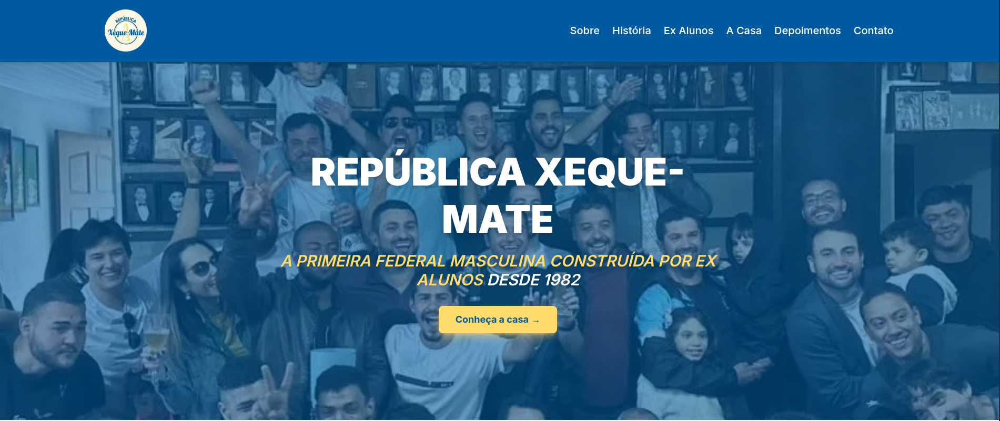
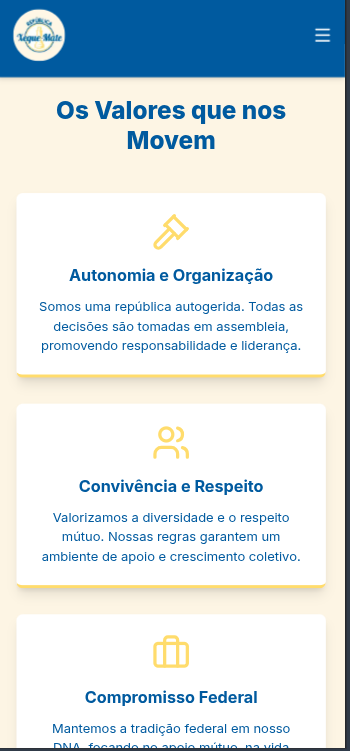

# República Xeque-Mate – Website

Website institucional desenvolvido para a República Xeque-Mate, com foco em apresentação, informações e identidade visual.

## 🛠 Tecnologias utilizadas
- TypeScript
- React / Next.js (ajuste se não usar)
- CSS / Tailwind / Styled Components (ajuste)
- Deploy com Vercel

## ✨ Funcionalidades
- Layout responsivo
- Navegação simples e intuitiva
- Design focado em identidade visual
- Conteúdo informativo

## 🌐 Projeto online
🔗 https://republica-xeque-mate-site.vercel.app/

## 📷 Preview

  

  

## 💼 Observação
Projeto real desenvolvido para fins institucionais.

